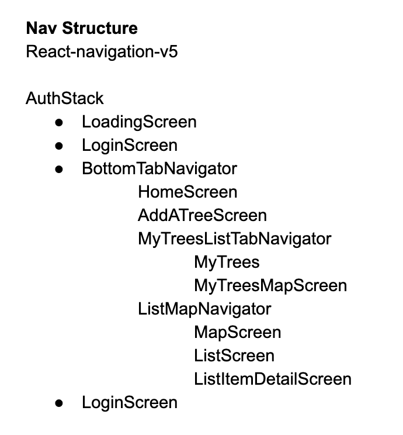

# FRUIT FINDER MOBILE APP

## By **Jay Winebrenner**

##  About

The Fruit Finder is a mobile application for Android and iOS which connects people to the pleniful fruit tree bounties in their neighborhood. The goal of The Fruit Finder is to document all fruit trees in the Portland area to provide fresh, delicious fruit to those in want and to prevent needless food waste. 

## How It Works

Upon first running the app, the user will be directed to a map screen containing all of the trees available for gleaning in their proximity.  A bottom drawer contains all the trees available for gleaning in a list formatted by proximity to the user.

The All Trees filter in the drop down gives users access to Trees inputted by other users as well as verified trees sanctioned by the Portland Fruit Tree Project. (note: Verified trees have not been entered into the database yet)

If a user would like to input trees into our database, they will need to login. Once loggin, users will be able to input trees and filter the map as well as the list in the bottom drawer by All Trees, Verified trees and My Trees. If a user needs to delete a tree they inputted to our database, it's as easy as hitting the delete icon. 

## Setup/Installation Requirements

### Zip:

 1. Go to the repository location where you will find the clone/download button.
 2. Navigate to the directory (folder) that contains your browser's downloads via your terminal or Command Line interface.
 3. Double-click on **fruit-tree-finder** directory (folder).
 4. Open the directory contents by extracting/unzipping the documents from the folder.
 5. Type // npm i // followed by // npm run start //. This will initialize the Fruit Tree Finder and spin up the server. You can use the app via your phone using Expo Client or an iOS / Android.

- - -

## Specifications

- The Fruit Tree Finder uses Functional Components exclusively and uses Hooks for state management. There is not one Classical componenet in the app. Redux was not necessary. 

- - -

## Technologies Used

 - React Native
 - React Navigation v5
 - Firebase Realtime Database
 - Firebase Authentication

- - -

### Support and Contact

If you run into any issues or have any questions as about anything, please contact **Jay Winebrenner**. jaywinebrenner@gmail.com

### License

Permission is hereby granted, free of charge, to any person obtaining a copy of this software and associated documentation files (the "Software"), to deal in the Software without restriction, including without limitation the rights to use, copy, modify, merge, publish, distribute, sublicense, and/or sell copies of the Software, and to permit persons to whom the Software is furnished to do so, subject to the following conditions:

The above copyright notice and this permission notice shall be included in all copies or substantial portions of the Software.

THE SOFTWARE IS PROVIDED "AS IS", WITHOUT WARRANTY OF ANY KIND, EXPRESS OR IMPLIED, INCLUDING BUT NOT LIMITED TO THE WARRANTIES OF MERCHANTABILITY, FITNESS FOR A PARTICULAR PURPOSE AND NON-INFRINGEMENT. IN NO EVENT SHALL THE AUTHORS OR COPYRIGHT HOLDERS BE LIABLE FOR ANY CLAIM, DAMAGES OR OTHER LIABILITY, WHETHER IN AN ACTION OF CONTRACT, TORT OR OTHERWISE, ARISING FROM, OUT OF OR IN CONNECTION WITH THE SOFTWARE OR THE USE OR OTHER DEALINGS IN THE SOFTWARE.

Copyright (c) 2020 **Jay Winebrenner**